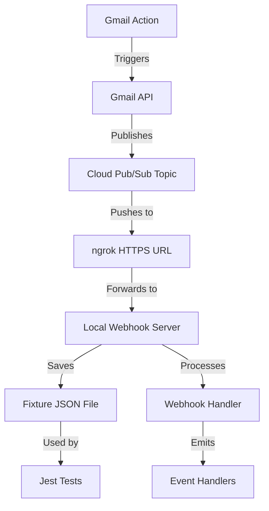

# Gmail Webhook Testing Guide

This guide explains how to capture real Gmail webhook events using ngrok and test them with fixtures.

## Overview

The webhook testing system works as follows:

1. **Webhook Server** - Receives Gmail push notifications from Google Cloud Pub/Sub
2. **ngrok** - Exposes your local server to the internet with HTTPS
3. **Fixtures** - Real webhook payloads are automatically saved as JSON files
4. **Tests** - Dynamic tests run against all captured fixtures

## Prerequisites

- Gmail SDK set up with OAuth2 credentials
- Google Cloud Project with Gmail API enabled
- ngrok installed: https://ngrok.com/download
- Active Gmail account

## Step-by-Step Setup

### 1. Install ngrok

```bash
# macOS (with Homebrew)
brew install ngrok/ngrok/ngrok

# Or download from https://ngrok.com/download

# Verify installation
ngrok version
```

### 2. Set Up Google Cloud Pub/Sub

#### Create Pub/Sub Topic

```bash
# Authenticate
gcloud auth login

# Set your project
gcloud config set project YOUR_PROJECT_ID

# Create topic
gcloud pubsub topics create gmail-push

# Grant Gmail API permission to publish
gcloud pubsub topics add-iam-policy-binding gmail-push \
  --member=serviceAccount:gmail-api-push@system.gserviceaccount.com \
  --role=roles/pubsub.publisher
```

### 3. Start the Webhook Server

```bash
cd demo/sdk/gmail
npm run webhook-server
```

You should see:

```
📮 Gmail Webhook Server Started
   Port: 3000
   Webhook endpoint: http://localhost:3000/webhook/gmail
   Fixtures directory: /path/to/tests/fixtures
```

### 4. Start ngrok

In a new terminal:

```bash
ngrok http 3000
```

You'll see output like:

```
Session Status                online
Forwarding                    https://abc123.ngrok.io -> http://localhost:3000
```

**Copy the HTTPS URL** (e.g., `https://abc123.ngrok.io`)

### 5. Create Pub/Sub Push Subscription

```bash
gcloud pubsub subscriptions create gmail-push-sub \
  --topic=gmail-push \
  --push-endpoint=https://YOUR_NGROK_URL/webhook/gmail
```

Replace `YOUR_NGROK_URL` with the URL from ngrok (without trailing slash).

### 6. Configure Environment

Update your `.env` file:

```bash
GMAIL_WEBHOOK_TOPIC=projects/YOUR_PROJECT_ID/topics/gmail-push
```

### 7. Start Gmail Watch

Run this script or execute via tests:

```typescript
import { Gmail } from '../api';

const watchResponse = await Gmail.Users.watch('me', {
  topicName: 'projects/YOUR_PROJECT_ID/topics/gmail-push',
  labelIds: ['INBOX'],
});

console.log('Watch started!');
console.log('History ID:', watchResponse.historyId);
console.log('Expires:', new Date(parseInt(watchResponse.expiration!)).toISOString());
```

Or run the webhook test:

```bash
npm test -- webhooks.test.ts
```

### 8. Trigger Events

Now perform actions in your Gmail account:

**Send an Email:**
```bash
# Send yourself an email
# Or use Gmail web interface
```

**Modify Labels:**
- Star/unstar a message
- Mark as read/unread
- Add/remove labels
- Move to trash

**Delete Messages:**
- Permanently delete a message from trash

Watch your webhook server terminal - you should see events being captured!

### 9. Verify Fixtures

Check the fixtures directory:

```bash
ls -la demo/sdk/gmail/tests/fixtures/
```

You should see JSON files like:
```
history_2024-12-19T10-30-15-123Z_abc123.json
message_received_2024-12-19T10-30-20-456Z_def456.json
message_label_changed_2024-12-19T10-30-25-789Z_ghi789.json
raw_pubsub_notification_2024-12-19T10-30-15-000Z_jkl012.json
```

### 10. Run Tests

```bash
npm test -- webhooks.test.ts
```

The tests will automatically discover and test all captured fixtures!

## Expected Event Types

The webhook server captures these event types:

1. **history** - Generic history change notification
2. **message_received** - New message arrived
3. **message_deleted** - Message was deleted
4. **message_label_changed** - Labels were added/removed
5. **raw_pubsub_notification** - Raw Pub/Sub payload

## Fixture File Format

Each fixture is saved with this naming pattern:

```
{eventType}_{timestamp}_{random}.json
```

Example fixture contents:

```json
{
  "type": "messageReceived",
  "emailAddress": "user@gmail.com",
  "historyId": "391651",
  "message": {
    "id": "18d4f2e3c4b5a6d7",
    "threadId": "18d4f2e3c4b5a6d7",
    "labelIds": ["INBOX", "UNREAD"],
    "snippet": "This is the message snippet..."
  }
}
```

## Testing Flow



## Webhook Server Endpoints

- `POST /webhook/gmail` - Receives Pub/Sub push notifications
- `GET /health` - Health check (returns fixture count)
- `GET /fixtures` - List all captured fixtures
- `GET /webhook/history` - Get last history ID
- `POST /webhook/history` - Set last history ID

## Troubleshooting

### No Events Received

**Check ngrok is running:**
```bash
curl https://YOUR_NGROK_URL/health
```

**Verify Pub/Sub subscription:**
```bash
gcloud pubsub subscriptions describe gmail-push-sub
```

**Check watch is active:**
```typescript
// Watch expires after 7 days max, renew if needed
const profile = await Gmail.Users.getProfile('me');
console.log('Current history ID:', profile.historyId);
```

### Events Not Saving

**Check fixtures directory exists:**
```bash
ls -la demo/sdk/gmail/tests/fixtures/
```

**Check file permissions:**
```bash
chmod 755 demo/sdk/gmail/tests/fixtures/
```

### ngrok Session Expired

ngrok free tier sessions expire after 2 hours. Restart:

```bash
# Stop ngrok (Ctrl+C)
# Restart
ngrok http 3000

# Update Pub/Sub subscription with new URL
gcloud pubsub subscriptions update gmail-push-sub \
  --push-endpoint=https://NEW_NGROK_URL/webhook/gmail
```

### Watch Expired

Watches expire after maximum 7 days. Renew:

```bash
npm test -- webhooks.test.ts
# Or run watch start code again
```

## Cleanup

### Stop Watch

```bash
npm test -- -t "should stop watching mailbox"
```

Or via API:
```typescript
await Gmail.Users.stop('me');
```

### Delete Pub/Sub Resources

```bash
gcloud pubsub subscriptions delete gmail-push-sub
gcloud pubsub topics delete gmail-push
```

### Clear Fixtures

```bash
rm demo/sdk/gmail/tests/fixtures/*.json
```

## Tips for Capturing Events

1. **Message Received:** Send yourself an email or have someone send you one
2. **Label Changed:** Star a message, then unstar it (creates 2 events)
3. **Message Deleted:** Permanently delete from trash
4. **Multiple Events:** Perform batch operations (select multiple messages)

## Advanced: Manual Testing

You can manually test the webhook handler:

```typescript
import { createWebhookHandler } from './webhook-handler';
import * as fs from 'fs';

const handler = createWebhookHandler({ autoFetchHistory: false });

handler.on('messageReceived', (event) => {
  console.log('New message:', event.message.id);
});

// Load a fixture
const fixture = JSON.parse(fs.readFileSync('./tests/fixtures/message_received_xyz.json', 'utf-8'));

// Process it
const mockNotification = {
  message: {
    data: Buffer.from(JSON.stringify({
      emailAddress: fixture.emailAddress,
      historyId: fixture.historyId,
    })).toString('base64'),
  },
};

await handler.handlePubSubNotification(mockNotification);
```

## Resources

- [Gmail Push Notifications](https://developers.google.com/gmail/api/guides/push)
- [Google Cloud Pub/Sub](https://cloud.google.com/pubsub/docs)
- [ngrok Documentation](https://ngrok.com/docs)
- [Gmail Watch API](https://developers.google.com/gmail/api/reference/rest/v1/users/watch)

