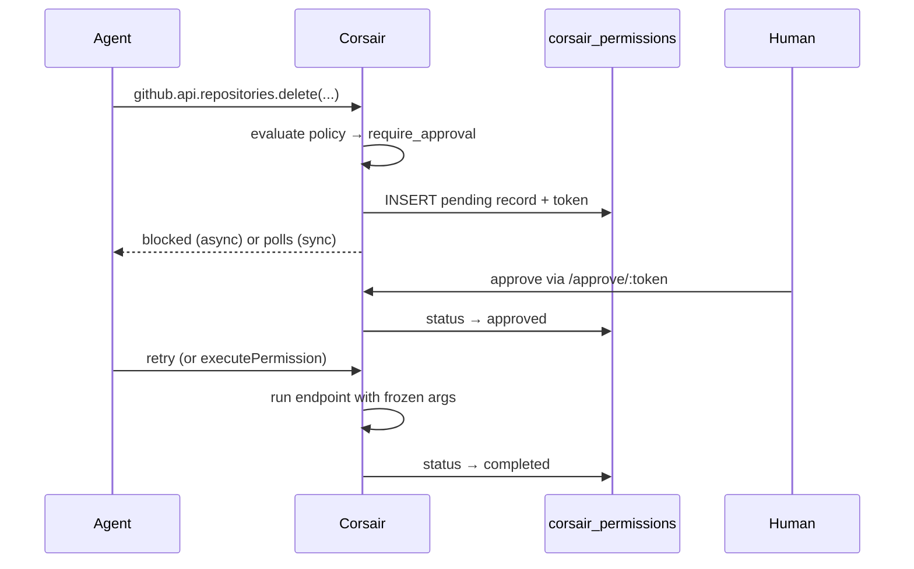

import { WindowsMigrationNote } from '/snippets/windows-shell.mdx';

When an AI agent calls Corsair, you need guardrails. Permissions let you set a policy per integration — reads go through, writes may need sign-off, destructive actions can be blocked entirely.

```ts corsair.ts
import { createCorsair } from "corsair";
import { github } from "@corsair-dev/github";

export const corsair = createCorsair({
    database: db,
    kek: process.env.CORSAIR_KEK!,
    approval: {
        timeout: "30m",
        onTimeout: "deny",
        mode: "asynchronous",
        formatAsyncMessage: ({ token }) =>
            `Approval required. Visit https://your-app.com/approve/${token} to approve or deny, then retry.`,
    },
    plugins: [
        github({
            permissions: {
                mode: "cautious",
                overrides: {
                    "repositories.delete": "deny",
                    "releases.create": "require_approval",
                },
            },
        }),
    ],
});
```

---

## How it works

Every plugin endpoint has a **risk level** (`read`, `write`, or `destructive`). Your **permission mode** maps each risk level to a **policy**. When an agent calls a gated endpoint:

1. Corsair evaluates the policy for that endpoint
2. If `allow` → the call proceeds immediately
3. If `deny` → the call is blocked with no database record
4. If `require_approval` → Corsair writes a row to `corsair_permissions` and blocks the call until a human approves

Approved actions are **single-use**. Once the endpoint runs successfully, the record moves to `completed` and cannot be replayed.



<Warning>
Permissions require a database. Without `corsair_permissions`, any endpoint that needs approval falls back to **deny**.
</Warning>

---

## Add the permissions table

If you already ran the [quick start](/getting-started/quick-start) migration, add this table once. The schema matches what Corsair expects at runtime.

<Tabs>
  <Tab title="SQLite">

<AccordionGroup>
<Accordion title="View migration SQL">

```sql permissions.sql
CREATE TABLE IF NOT EXISTS corsair_permissions (
    id TEXT PRIMARY KEY,
    created_at INTEGER NOT NULL,
    updated_at INTEGER NOT NULL,
    token TEXT NOT NULL,
    plugin TEXT NOT NULL,
    endpoint TEXT NOT NULL,
    args TEXT NOT NULL,
    tenant_id TEXT NOT NULL DEFAULT 'default',
    status TEXT NOT NULL DEFAULT 'pending',
    expires_at TEXT NOT NULL,
    error TEXT NULL
);
```

</Accordion>
</AccordionGroup>

<Tabs>
  <Tab title="macOS / Linux">

```bash
sqlite3 corsair.db < permissions.sql
```

  </Tab>
  <Tab title="Windows (PowerShell)">

<WindowsMigrationNote />

```powershell
Get-Content permissions.sql | sqlite3 corsair.db
```

  </Tab>
</Tabs>

  </Tab>
  <Tab title="PostgreSQL">

<AccordionGroup>
<Accordion title="View migration SQL">

```sql permissions.sql
CREATE TABLE IF NOT EXISTS corsair_permissions (
    id TEXT PRIMARY KEY,
    created_at TIMESTAMPTZ NOT NULL DEFAULT NOW(),
    updated_at TIMESTAMPTZ NOT NULL DEFAULT NOW(),
    token TEXT NOT NULL,
    plugin TEXT NOT NULL,
    endpoint TEXT NOT NULL,
    args TEXT NOT NULL,
    tenant_id TEXT NOT NULL DEFAULT 'default',
    status TEXT NOT NULL DEFAULT 'pending',
    expires_at TEXT NOT NULL,
    error TEXT NULL
);
```

</Accordion>
</AccordionGroup>

<Tabs>
  <Tab title="macOS / Linux">

```bash
psql $DATABASE_URL -f permissions.sql
```

  </Tab>
  <Tab title="Windows (PowerShell)">

<WindowsMigrationNote />

```powershell
psql $env:DATABASE_URL -f permissions.sql
```

  </Tab>
</Tabs>

  </Tab>
</Tabs>

### Column reference

| Column | Purpose |
| --- | --- |
| `token` | 64-character hex token embedded in review URLs — the public handle for approve/deny |
| `plugin` | Plugin id, e.g. `github` |
| `endpoint` | Dot-notation path, e.g. `repositories.delete` |
| `args` | JSON-encoded arguments frozen at request time — replayed exactly on approval |
| `tenant_id` | Tenant scope for multi-tenant instances. Defaults to `default` |
| `status` | Lifecycle state (see below) |
| `expires_at` | ISO8601 timestamp — when the request becomes invalid |
| `error` | Error message when status is `failed` |

---

## Permission modes

Set a default mode per plugin with `permissions.mode`. Each mode maps risk levels to policies:

| Mode | Read | Write | Destructive |
| --- | --- | --- | --- |
| `open` | allow | allow | allow |
| `cautious` | allow | allow | require_approval |
| `strict` | allow | require_approval | deny |
| `readonly` | allow | deny | deny |

`cautious` is a good default for agent workloads — agents can read and write freely, but destructive actions need a human in the loop.

```ts corsair.ts
github({
    permissions: { mode: "cautious" },
})
```

---

## Approval policies

Three resolved policies control what happens at call time:

| Policy | Behavior |
| --- | --- |
| `allow` | Executes immediately — no approval record |
| `deny` | Blocked by policy. Logs a message pointing you to the corsair config |
| `require_approval` | Creates a `pending` record in `corsair_permissions` and blocks until approved |

Policies come from the mode matrix above, unless you override a specific endpoint.

---

## Overrides

Use `permissions.overrides` to tighten or loosen individual endpoints beyond the mode default. Keys are dot-notation paths through the plugin's endpoint tree — invalid paths are compile-time errors.

```ts corsair.ts
github({
    permissions: {
        mode: "cautious",
        overrides: {
            "repositories.delete": "deny",           // never allowed, even with approval
            "releases.create": "require_approval",   // escalate a write beyond mode default
            "issues.list": "allow",                  // loosen a strict-mode write (if needed)
        },
    },
})
```

Overrides take precedence over the mode matrix. An override of `deny` always wins — no approval record is created.

---

## Status lifecycle

Each approval request moves through these states:

| Status | Meaning |
| --- | --- |
| `pending` | Waiting for human approval |
| `approved` | Human signed off — ready to execute (single-use) |
| `executing` | `executePermission` is running the frozen args |
| `completed` | Action ran successfully — approval consumed |
| `denied` | Human declined the request |
| `expired` | `expires_at` passed before a decision |
| `failed` | Endpoint threw during execution — see `error` column |

Corsair deduplicates pending requests. If the same plugin, endpoint, args, and tenant already have a non-expired `pending` record, a second call returns the existing token instead of creating a duplicate.

---

## Timeout

Configure the approval window at the root with `createCorsair({ approval: ... })`:

```ts corsair.ts
export const corsair = createCorsair({
    approval: {
        timeout: "30m",      // duration string: '30s', '10m', '1h', '2h30m', '1d'
        onTimeout: "deny",   // 'deny' (recommended) or 'approve'
    },
    // ...
});
```

- **`timeout`** — how long a `pending` record stays valid. Defaults to `10m` if not set. Written to `expires_at` when the record is created.
- **`onTimeout`** — intended behavior when the window closes without a response. With `deny`, expired records are treated as blocked. Use `approve` only in low-risk, fully trusted environments.

After `expires_at`, the record is no longer actionable. Synchronous mode returns a timeout error; asynchronous retries see the request as expired.

---

## Synchronous vs asynchronous

Control how blocked calls behave with `approval.mode`:

### Asynchronous (default)

The tool call returns immediately with an error. The agent sees the blocked result and must stop or retry after the user approves.

Best when:
- The agent should explicitly tell the user to visit a review page
- You want the model to handle denial gracefully and not burn tokens polling

```ts corsair.ts
approval: {
    timeout: "1h",
    onTimeout: "deny",
    mode: "asynchronous",
    formatAsyncMessage: ({ token, plugin, endpoint }) =>
        `Action ${plugin}.${endpoint} requires approval. Visit https://your-app.com/approve/${token} then retry.`,
},
```

### Synchronous

The tool call **blocks** and polls `corsair_permissions` every 500 ms until the user approves, denies, or the timeout elapses. From the agent's perspective, it is just a slow tool call — the model does not need to handle a separate approval step.

<Warning>
Many agents enforce automatic timeouts on tool calls to prevent hangs. If your agent cuts off long-running tools before you can approve, use **asynchronous** mode instead — the call returns immediately and the agent retries after approval.
</Warning>

Best when:
- You have a review UI open alongside the agent session
- You want approval to feel seamless — approve in the UI, the agent continues automatically

```ts corsair.ts
approval: {
    timeout: "10m",
    onTimeout: "deny",
    mode: "synchronous",
},
```

### Dynamic mode

Pass a function to switch modes per request — useful when approval behavior depends on runtime context:

```ts corsair.ts
approval: {
    timeout: "30m",
    onTimeout: "deny",
    mode: () => (process.env.NODE_ENV === "production" ? "asynchronous" : "synchronous"),
},
```

---

## Handling permission approvals

When an action requires approval, Corsair inserts a row into `corsair_permissions` with a unique **token**. That token is what you put in review URLs, Slack messages, or anywhere else you surface the request. Look up the row by token to see exactly what the agent wants to do — the `args` column holds the JSON-encoded arguments frozen at request time.

```sql
SELECT plugin, endpoint, args, status, tenant_id, expires_at
FROM corsair_permissions
WHERE token = 'abc123...';
```

To resolve the request, update `status`:

| Decision | Set `status` to |
| --- | --- |
| Approve | `approved` |
| Deny | `denied` |

```sql
-- Approve
UPDATE corsair_permissions
SET status = 'approved', updated_at = NOW()
WHERE token = $1 AND status = 'pending';

-- Deny
UPDATE corsair_permissions
SET status = 'denied', updated_at = NOW()
WHERE token = $1 AND status = 'pending';
```

That's the entire approval contract. Corsair handles the rest — polling in synchronous mode, retry matching in asynchronous mode, and execution once the status is `approved`.

### Build your own review flow

How you approve is entirely up to you. A few common patterns:

**Manual review UI** — Add a page in your app that lists pending requests, shows `plugin`, `endpoint`, and parsed `args`, and renders Approve / Deny buttons that run the `UPDATE` above.

**Automated reviewer agent** — Send the pending request to a second agent that evaluates whether the action is safe, then programmatically sets `status` to `approved` or `denied`. Useful when you want policy checks without a human in the loop for every write.

```ts review-page.ts
import { corsair } from "./corsair";

export async function getReviewDetails(token: string) {
    const record = await corsair.permissions.find_by_token(token);
    if (!record || record.status !== "pending") return null;

    return {
        plugin: record.plugin,
        endpoint: record.endpoint,
        args: JSON.parse(record.args),
        expiresAt: record.expires_at,
    };
}

// Your route handler updates status directly on your database connection,
// or call executePermission after approving to run immediately (see below).
```

Once `status` is `approved`, either the original agent retries the call or you invoke `executePermission` yourself to run the action without waiting for a retry.

---

## Integrating with an agent

### MCP / coding agents

When using [MCP adapters](/mcp-adapters/mcp-adapters), permissions gate `run_script` calls automatically. No extra wiring — configure `permissions` on each plugin and `approval` on `createCorsair`.

In **asynchronous** mode, customize the error the LLM sees with `formatAsyncMessage`. Point the agent (and the user) at your review page:

```ts corsair.ts
const PUBLIC_URL = process.env.PUBLIC_URL ?? "http://localhost:3000";

export const corsair = createCorsair({
    approval: {
        timeout: "1h",
        onTimeout: "deny",
        mode: "asynchronous",
        formatAsyncMessage: ({ token }) =>
            `Approval required. Visit ${PUBLIC_URL}/approve/${token} to approve or deny, then retry.`,
    },
    // ...
});
```

After approval, the agent retries the same call. Corsair finds the `approved` record, runs the endpoint, and marks it `completed`.

### `executePermission` (optional)

If you don't want to wait for the agent to retry after approval, call `executePermission` once `status` is `approved`. It replays the frozen args directly — no LLM involved:

```ts approve-handler.ts
import { executePermission } from "corsair";
import { corsair } from "./corsair";

export async function handleApprove(token: string) {
    // 1. SET status = 'approved' on the corsair_permissions row
    // 2. Execute immediately
    const result = await executePermission(corsair, token);
    return result;
}
```

`executePermission` scopes to the correct tenant via `withTenant`, navigates `corsair[plugin].api[endpoint]`, and marks the record `completed` on success.

<Note>
The `corsair.permissions` namespace exposes `find_by_token` and `find_by_permission_id` for reads, but intentionally does not include approve/deny transitions — those happen in your review flow.
</Note>

---

## Multi-tenancy

In multi-tenant setups, each approval record stores the `tenant_id` from the active `withTenant()` context. When the action executes, Corsair scopes to that tenant's credentials and data.

```ts
const tenant = corsair.withTenant("user_abc123");
await tenant.github.api.repositories.delete({ owner, repo });
// → corsair_permissions.tenant_id = 'user_abc123'
```

See [Multi-Tenancy](/concepts/multi-tenancy) for tenant scoping details.

---

## What's next

<CardGroup cols={2}>
  <Card title="MCP Adapters" href="/mcp-adapters/mcp-adapters">
    Wire Corsair into Cursor, Claude Code, or any MCP-compatible agent.
  </Card>
  <Card title="Multi-Tenancy" href="/concepts/multi-tenancy">
    Scope approvals and credentials per user with withTenant().
  </Card>
  <Card title="Database" href="/concepts/database">
    The four core tables Corsair uses for synced integration data.
  </Card>
  <Card title="Hooks" href="/concepts/hooks">
    Add custom logic before and after API calls — logging, validation, side effects.
  </Card>
</CardGroup>
