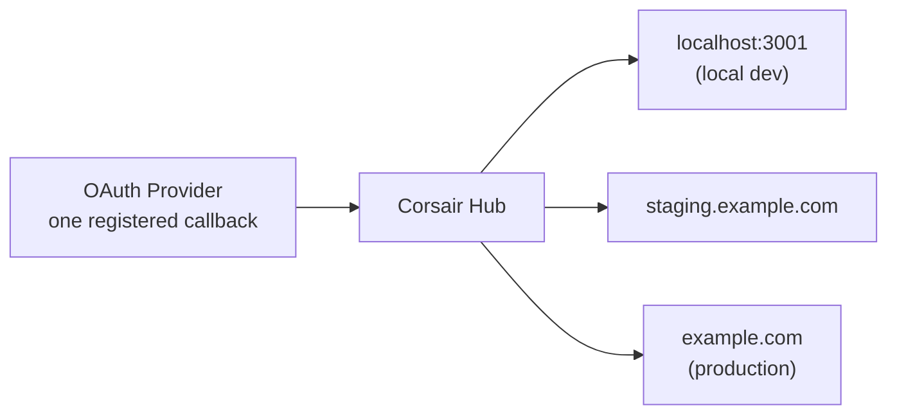

Without Hub, the OAuth redirect URI you register with a provider has to match the environment handling the callback. Local, staging, and production each need their own redirect URI, which means either separate provider apps or rewriting the registered URI every time you switch environments.

With Hub you register **one** callback URL with the provider — `https://auth.corsair.dev/oauth/callback`. Hub receives the callback and routes the result to your app's **delivery URL**, an endpoint you allowlist per environment.



## How delivery works

After a user approves access, the provider redirects to the single callback URL registered with Hub. Hub then **redirects the user's browser** to the selected delivery URL with a signed payload (`?d=…`). Because delivery is browser-mediated, it reaches `localhost` without a tunnel like ngrok.

Your app exposes the delivery endpoint through the mounted handler. `toNextJsHandler` serves Hub delivery at the base path automatically:

```ts app/api/corsair/[[...path]]/route.ts
import { toNextJsHandler } from "corsair";
import { corsair } from "@/server";

export const { GET, POST, OPTIONS } = toNextJsHandler(corsair, {
    basePath: "/api/corsair",
});
```

The `deliveryUrl` in your `hub` config points at this handler:

```ts corsair.ts
export const corsair = createCorsair({
    plugins: [github(), slack()],
    database: db,
    kek: process.env.CORSAIR_KEK!,
    hub: {
        projectApiKey: process.env.CORSAIR_API_KEY!,
        signingSecret: process.env.CORSAIR_SIGNING_SECRET!,
        deliveryUrl: `${appUrl}/api/corsair`,
    },
});
```

## The signing secret

Each delivered payload is signed with your `signingSecret`. Your handler verifies the signature before accepting it, so a delivery URL only acts on payloads that genuinely came from Hub for your project. Keep the signing secret in your environment, never in client code.

## Adding an environment

Add the environment's delivery URL to your project's **Delivery URLs** allowlist in the [Hub dashboard](https://hub.corsair.dev/dashboard). Hub only delivers to allowlisted endpoints, and each must match the `deliveryUrl` in that environment's `hub` config. Register localhost and production separately if you use both.

No provider-side change is needed, because the provider still only knows about Hub's single callback URL. So onboarding a teammate's local environment or a new preview deployment never touches any provider's OAuth app settings.

<Info>
Delivery URLs change *where the OAuth result is routed*. They do not change where credentials are stored. Tokens are still encrypted and persisted only in your database. See [Hub overview](/hub/overview#hub-stores-none-of-your-credentials).
</Info>

## What's next

<CardGroup cols={2}>
  <Card title="Hub overview" href="/hub/overview">
    The relay model and the public-URL surfaces Hub provides.
  </Card>
  <Card title="Connect / OAuth" href="/management/connect">
    The createLink API and Hub delivery details.
  </Card>
  <Card title="Manual or Hub" href="/hub/manual-vs-hub">
    What you build in each mode, side by side.
  </Card>
  <Card title="OAuth 2.0" href="/concepts/oauth">
    How the connect flow works end to end.
  </Card>
</CardGroup>
