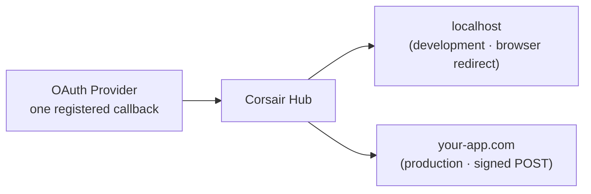

Without Hub, the OAuth redirect URI you register with a provider has to match the environment handling the callback. Local, staging, and production each need their own redirect URI, which means either separate provider apps or rewriting the registered URI every time you switch environments.

With Hub you register **one** callback URL with the provider — `https://auth.corsair.dev/oauth/callback`. Hub receives the callback and delivers the result to your app. **How** it delivers depends on which [environment](/hub/environments) started the flow — development uses a browser redirect; production uses a signed server POST. See [Why delivery works differently](/hub/environments#why-delivery-works-differently) for the full picture.



## Mount your handler

Your app exposes the delivery endpoint through the mounted Corsair handler. `toNextJsHandler` serves Hub delivery at the base path automatically:

```ts app/api/corsair/[[...path]]/route.ts
import { toNextJsHandler } from "corsair";
import { corsair } from "@/server";

export const { GET, POST, OPTIONS } = toNextJsHandler(corsair, {
    basePath: "/api/corsair",
});
```

You do **not** put the delivery URL in your `hub` config. It is resolved per environment (see below).

## Development delivery

When your app uses a **development** API key (`ck_dev_…`), the SDK auto-detects where to deliver:

```bash .env.local
CORSAIR_API_KEY=ck_dev_...
CORSAIR_SIGNING_SECRET=...
# Optional override:
CORSAIR_DELIVERY_URL=http://localhost:3001/api/corsair
```

Detection order: `CORSAIR_DELIVERY_URL` → `APP_URL` / `NEXT_PUBLIC_APP_URL` / `VERCEL_URL` (with `/api/corsair`) → `http://localhost:{PORT}/api/corsair`.

Hub **redirects the user's browser** to that URL with a signed payload (`?d=…`). Because delivery is browser-mediated, it reaches `localhost` without a tunnel like ngrok.

No dashboard registration is required for development.

## Production delivery

When your app uses a **production** API key (`ck_prod_…`), Hub POSTs a **signed JSON envelope** to the delivery URL registered in the [Hub dashboard](/hub/dashboard) (**Delivery URLs** tab → Activate production).

```bash
CORSAIR_API_KEY=ck_prod_...
CORSAIR_SIGNING_SECRET=...
```

The URL must be a public HTTPS endpoint (not localhost). Hub signs each POST with your `signingSecret`; your handler verifies the signature before accepting it.

Register or update the URL in the dashboard before deploying — production connect flows fail until production is activated.

## The signing secret

Each delivered payload is signed with your environment's `signingSecret`. Your handler verifies the signature before accepting it, so only payloads from Hub for your project are applied. Keep the signing secret in server-side environment variables, never in client code.

<Info>
Delivery URLs change *where the result is routed*. They do not change where credentials are stored. Tokens are still encrypted and persisted only in your database. See [Hub overview](/hub/overview#hub-stores-none-of-your-credentials).
</Info>

## What's next

<CardGroup cols={2}>
  <Card title="Environments" href="/hub/environments">
    Development vs production keys and when to use each.
  </Card>
  <Card title="Hub dashboard" href="/hub/dashboard">
    Activate production and manage delivery URLs.
  </Card>
  <Card title="Connect / OAuth" href="/management/connect">
    The createLink API.
  </Card>
  <Card title="Manual or Hub" href="/hub/manual-vs-hub">
    What you build in each mode.
  </Card>
</CardGroup>
