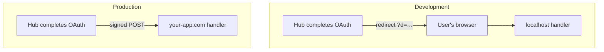

When you create a project in the [Hub dashboard](https://hub.corsair.dev/dashboard), you get two environments: **Development** and **Production**. They are not interchangeable — each is tuned for a different stage of building and shipping.

The SDK knows which one you are using from your API key prefix (`ck_dev_…` or `ck_prod_…`). Point your local app at development keys; point your deployed app at production keys.

<Info>
Both environments share the same OAuth provider callback URL (`https://auth.corsair.dev/oauth/callback`). You register it once with GitHub, Google, and so on — Hub routes the result back to the environment that started the flow.
</Info>

## Development environment

A **Development** environment is the default starting point. It is designed to make local work fast: no delivery URL to register, no tunnel, no production activation step.

Some characteristics of Development:

- **Optimized for `localhost`.** After OAuth completes, Hub sends the result to your machine via a browser redirect — not a server callback. Your browser can reach `localhost`; Hub's servers often cannot.
- **Auto-detected delivery URL.** The SDK figures out where your handler lives from `CORSAIR_DELIVERY_URL`, `APP_URL`, or `PORT`. You do not configure this in the dashboard.
- **Separate credentials.** Development has its own API key and signing secret. They are shown on the **Keys** tab when the environment picker is set to Development.
- **Relaxed setup.** No "activate" step. As long as your app is running locally and you are using `ck_dev_…` keys, connect flows work.
- **All configured plugins available.** Useful for trying integrations before you ship. Production may ask you to choose which Corsair-managed integrations to enable — see [Hub dashboard](/hub/dashboard#corsair-managed-integrations).

Development is for building and testing on your machine. It is not a substitute for a deployed production setup.

### Local setup

```bash .env.local
CORSAIR_API_KEY=ck_dev_...
CORSAIR_SIGNING_SECRET=...
CORSAIR_KEK=...

# Optional — override auto-detection:
# CORSAIR_DELIVERY_URL=http://localhost:3001/api/corsair
```

Copy development credentials from the dashboard **Keys** tab. Mount your handler at `/api/corsair` and run your app — Hub handles the rest.

## Production environment

A **Production** environment is for your live, deployed application — real users, real OAuth flows, real traffic.

Some characteristics of Production:

- **Requires activation.** Before connect flows work, register a public HTTPS delivery URL in the dashboard (**Delivery URLs** tab). This tells Hub where to send results in production.
- **Server-to-server delivery.** Hub POSTs a signed envelope directly to your app. No browser redirect — the user's browser is not in the loop after OAuth completes.
- **Stricter URL rules.** Delivery URLs must be public HTTPS endpoints. `localhost` is rejected.
- **Separate credentials.** Production has its own API key and signing secret (`ck_prod_…`). Never commit them; set them in your host's environment variables.
- **Corsair-managed integrations.** If your plan limits how many integrations Corsair manages in production, the dashboard asks you to select which ones. Development does not apply this limit.

When you deploy, switch your env vars from development keys to production keys and complete the activation step first.

### Deploy setup

<Steps>
  <Step title="Activate production in the dashboard">
    Open your project, switch the environment picker to **Production**, and go to **Delivery URLs**. Register your handler — for example `https://your-app.com/api/corsair`.
  </Step>
  <Step title="Set production credentials on your host">
    ```bash
    CORSAIR_API_KEY=ck_prod_...
    CORSAIR_SIGNING_SECRET=...
    CORSAIR_KEK=...
    ```
  </Step>
  <Step title="Deploy">
    Production connect, credential delivery, and approval flows now POST signed envelopes to your registered URL.
  </Step>
</Steps>

## Why delivery works differently

Hub lives on the public internet (`auth.corsair.dev`). Your app does not — at least not while you are developing locally. That gap drives almost every difference between the two environments.

**In development**, your app runs on `localhost`. Hub cannot reliably call `http://localhost:3000` from its servers — your machine is not reachable from the internet, and that is fine. Instead, after OAuth completes, Hub **redirects the user's browser** to your local handler with a signed payload (`?d=…`). The browser is already on your machine, so delivery works without ngrok or a tunnel.

**In production**, your app runs on a public HTTPS domain. Hub **POSTs a signed envelope** straight to your server. This is more secure and more reliable for live traffic: the result never passes through the browser URL bar, and your handler verifies every payload with your signing secret before accepting it.



Same Hub project, same provider callback URL — different delivery path depending on which API key started the flow.

## Preview and staging

Hub provides Development and Production per project. There is no separate "staging" environment type today. Here are practical patterns:

<Tabs>
<Tab title="Preview deploys (Vercel, Netlify, etc.)">

Use **development** API keys (`ck_dev_…`) on preview deployments. Set `CORSAIR_DELIVERY_URL` to the preview URL of your handler — for example `https://my-app-git-feature-team.vercel.app/api/corsair`.

Hub delivers via browser redirect, same as local development. This works well for PR previews without activating production.

</Tab>

<Tab title="Long-lived staging">

Create a **separate Hub project** for staging. Treat its production environment as your staging deploy: activate a delivery URL on your staging domain and use that project's `ck_prod_…` keys.

Changes in the staging project do not automatically sync to your main production project — configure each independently.

</Tab>

<Tab title="Shared production credentials">

You can point a subdomain of your production domain (for example `staging.your-app.com`) at the same Hub production environment and delivery URL as production. This shares OAuth state and connection data between staging and production, which is usually **not** what you want for isolated testing.

Prefer a separate Hub project unless you intentionally want shared connection data.

</Tab>
</Tabs>

## Quick reference

| | Development | Production |
| --- | --- | --- |
| API key | `ck_dev_…` | `ck_prod_…` |
| Best for | Local dev, PR previews | Deployed app |
| Delivery URL | Auto-detected (or `CORSAIR_DELIVERY_URL`) | Registered in dashboard |
| How Hub delivers | Browser redirect (`GET ?d=…`) | Signed server POST |
| Dashboard setup | Copy keys — done | Activate delivery URL + copy keys |
| `localhost` | ✅ | ❌ |

## What's next

<CardGroup cols={2}>
  <Card title="Delivery URLs" href="/hub/delivery-urls">
    Handler mounting and signing in more detail.
  </Card>
  <Card title="Hub dashboard" href="/hub/dashboard">
    Keys, connections, sign-in links, and activation.
  </Card>
  <Card title="Hub overview" href="/hub/overview">
    Full setup from scratch.
  </Card>
  <Card title="Connect / OAuth" href="/management/connect">
    The createLink API reference.
  </Card>
</CardGroup>
