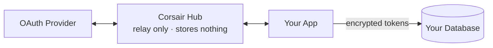
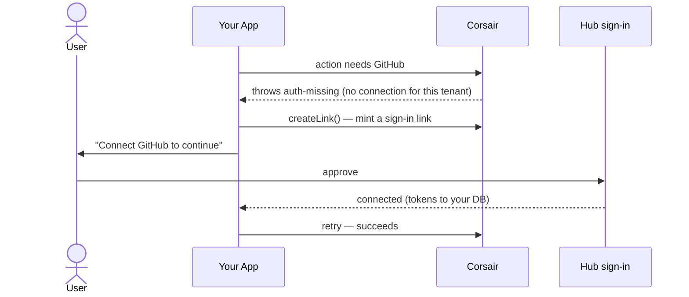
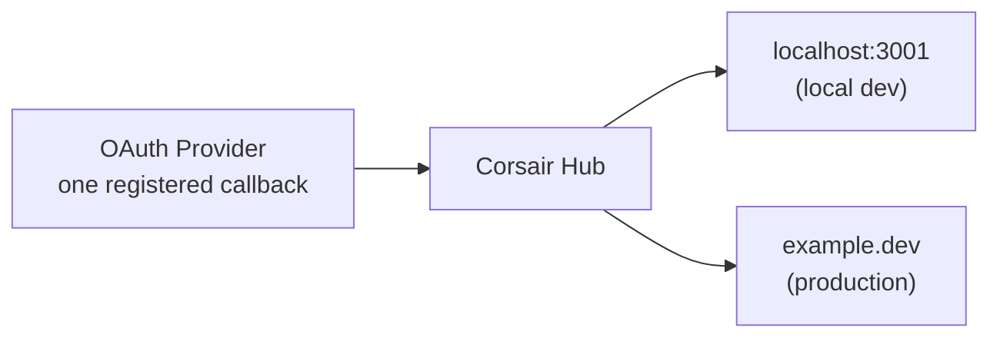

Corsair runs entirely in your own app. A few things, though, need a stable public URL that a third party can reach: OAuth callbacks and approval pages. In a self-hosted setup you build and host those yourself. **Hub is an optional hosted relay that provides them for you** so you can skip the boilerplate.

Hub is not a separate product or a separate SDK. It is the same `createCorsair` instance with one extra config block. Leave it out and you run fully self-hosted (the default). Add it and Corsair routes the public-URL surfaces through Corsair's hosted endpoint.

```ts corsair.ts
export const corsair = createCorsair({
    plugins: [github(), slack()],
    database: db,
    kek: process.env.CORSAIR_KEK!,
    // Add this block to route public-URL surfaces through Hub.
    // Remove it to run fully self-hosted.
    hub: {
        projectApiKey: process.env.CORSAIR_API_KEY!,
        signingSecret: process.env.CORSAIR_SIGNING_SECRET!,
        deliveryUrl: `${appUrl}/api/corsair`,
    },
});
```

<Info>
Self-hosted (`manual`) is the default and is fully featured. Hub is a convenience upgrade, not a requirement. See [Manual or Hub](/hub/manual-vs-hub) for a side-by-side.
</Info>

## Hub stores none of your credentials

This is the part to internalize first: **Hub is a relay, not a credential store.** It does not keep your users' access or refresh tokens. Tokens pass through the relay and are persisted only in **your** database, under your [KEK](/concepts/auth#envelope-encryption). Compromising the relay exposes no credentials, because there are none there to expose.



The same envelope encryption described in [Authentication](/concepts/auth#envelope-encryption) still applies. Each connection gets its own DEK, encrypted with your KEK, and the plaintext credential never lives anywhere but your database at runtime.

## What Hub provides

Three surfaces normally need a public URL. Hub hosts all three:

<CardGroup cols={2}>
  <Card title="OAuth callbacks">
    Register one callback URL with the provider. Hub holds it and fans the result out to every environment you run. No more swapping redirect URIs between dev and prod.
  </Card>
  <Card title="Hosted connect page">
    When an action needs a connection the user has not made yet, call `createLink()` to mint a Hub sign-in link. Hub hosts the connect page, so there is none to build. The user connects and retries.
  </Card>
  <Card title="Approval UI">
    For gated [permissions](/concepts/permissions), the SDK generates a link to a hosted approve/deny page. You do not build a review UI.
  </Card>
</CardGroup>

## Connecting an account

When an agent or app hits an action that needs a connection the user has not made yet, the call throws an auth-missing error. You call `createLink()` to mint a Hub sign-in link and send the user to it. Hub hosts the connect page, so there is no "connect this first" UI to build. The user follows the link, connects, and retries the original action.



## One callback, many environments

In a self-hosted setup, the OAuth redirect URI you register with each provider has to match the environment that is running, so you end up juggling separate provider apps (or rewriting redirect URIs) for local, staging, and production.

With Hub you register **one** callback URL with the provider. Hub receives the callback and forwards the result to your app's delivery URL, so the same provider callback works no matter which environment started the flow.



Each environment registers its own `deliveryUrl` in the project's delivery-URL allowlist, so onboarding a teammate's local setup or a new preview deployment never touches your provider OAuth app settings. See [Delivery URLs](/hub/delivery-urls) for the setup.

## Turning Hub on

Set up a project in the [Hub dashboard](https://hub.corsair.dev/dashboard), then pass the `hub` block to `createCorsair`.

<Steps>
  <Step title="Create an organization and project">
    Sign in to the dashboard, create an organization, then create your first project.
  </Step>
  <Step title="Copy your credentials">
    Each project has one API key pair. Add them to your environment. Rotating in the dashboard revokes the old pair immediately.

    ```bash .env
    CORSAIR_API_KEY=pk_...
    CORSAIR_SIGNING_SECRET=csec_...
    ```
  </Step>
  <Step title="Register the OAuth redirect URL">
    Register `https://auth.corsair.dev/oauth/callback` in each OAuth provider console (GitHub, Google, etc.). This is the single callback Hub holds for every environment.
  </Step>
  <Step title="Add a delivery URL">
    Add each environment's delivery URL to the project's allowlist. It must match the `deliveryUrl` in that environment's `hub` config. Register localhost and production separately if you use both.
  </Step>
</Steps>

The `hub` block carries three fields:

| Field | Purpose |
| ----- | ------- |
| `projectApiKey` | Identifies your project to the relay (the `pk_…` API key) |
| `signingSecret` | Verifies signed deliveries so only your app accepts them (the `csec_…` secret) |
| `deliveryUrl` | Where Hub delivers results (your mounted Corsair handler); must match a delivery URL in the allowlist |

Mount the handler once and it serves both Hub delivery and the [management API](/management/overview):

```ts app/api/corsair/[[...path]]/route.ts
import { toNextJsHandler } from "corsair";
import { corsair } from "@/server";

export const { GET, POST, OPTIONS } = toNextJsHandler(corsair, {
    basePath: "/api/corsair",
});
```

From there, minting a connect link is identical to the self-hosted path. The same `createLink` API is used in both modes; only where the link points changes. See [Connect / OAuth](/management/connect) for the reference.

## When to use Hub

Reach for Hub when you do not want to build and host connect pages and approval UIs, or when you want one provider callback to cover every environment. Stay self-hosted when you want full control of those surfaces or cannot add an external dependency in the auth path.

<Info>
Hub does not change how your agents call APIs. `corsair.slack.api.*`, `withTenant`, hooks, and the database layer all behave the same. Hub only affects the public-URL surfaces.
</Info>

## What's next

<CardGroup cols={2}>
  <Card title="Manual or Hub" href="/hub/manual-vs-hub">
    A side-by-side of what each mode requires you to build.
  </Card>
  <Card title="Delivery URLs" href="/hub/delivery-urls">
    One provider callback, fanned out to every environment you run.
  </Card>
  <Card title="Connect / OAuth" href="/management/connect">
    The unified createLink API used in both hub and manual modes.
  </Card>
  <Card title="Authentication" href="/concepts/auth">
    Envelope encryption and where credentials actually live.
  </Card>
</CardGroup>
