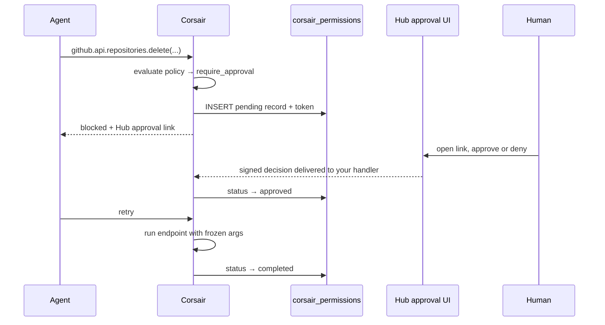

[Permissions](/concepts/permissions) gate risky agent actions behind human approval. The policy engine, the modes, and the `corsair_permissions` table work the same regardless of mode. The only thing Hub changes is **who hosts the approve/deny UI**.

- **Manual** — you build a review page and wire `manual.onApprovalRequired` so the agent receives a link to it.
- **Hub** — Corsair hosts the approval page. When a call is gated, the SDK returns a Hub approval link automatically. Nothing to build.

## How it works on Hub



The approval record still lives in **your** `corsair_permissions` table. Hub renders the UI and delivers the signed decision to your handler, which writes it to your database. Hub never touches your database and stores no approval data of its own.

## Configuration

With `hub` configured, blocked calls include a hosted approval URL with no extra setup:

```ts corsair.ts
export const corsair = createCorsair({
    plugins: [
        github({
            permissions: {
                mode: "cautious",
                overrides: { "repositories.delete": "deny" },
            },
        }),
    ],
    database: db,
    kek: process.env.CORSAIR_KEK!,
    permissions: {
        timeout: "1h",
        onTimeout: "deny",
        mode: "asynchronous",
    },
    hub: {
        projectApiKey: process.env.CORSAIR_API_KEY!,
        signingSecret: process.env.CORSAIR_SIGNING_SECRET!,
        deliveryUrl: `${appUrl}/api/corsair`,
    },
});
```

Compare with manual mode, where you provide the review surface yourself:

```ts corsair.ts
manual: {
    approvalBaseUrl: `${appUrl}/approve`,
    onApprovalRequired: ({ approvalUrl }) =>
        `Approval required. Visit ${approvalUrl} then retry.`,
},
```

<Info>
Approvals require the `corsair_permissions` table in both modes. Hub hosts the UI, not the data. See [Permissions](/concepts/permissions#add-the-permissions-table) for the migration.
</Info>

## Mixing modes

Connect through Hub while keeping approvals manual, or the reverse. The two surfaces are independent: pass both blocks and Hub handles connect while your own page handles approvals.

```ts corsair.ts
export const corsair = createCorsair({
    multiTenancy: false,
    database: db,
    kek: process.env.CORSAIR_KEK!,
    permissions: {
        timeout: "10m",
        onTimeout: "deny",
    },
    // Hub hosts the connect surface
    hub: {
        projectApiKey: process.env.CORSAIR_API_KEY!,
        signingSecret: process.env.CORSAIR_SIGNING_SECRET!,
        deliveryUrl: `${appUrl}/api/corsair`,
    },
    // Approvals stay on your own page
    manual: {
        // Corsair appends the token: ${appUrl}/permissions/[token]
        approvalBaseUrl: `${appUrl}/permissions`,
        onApprovalRequired: ({ approvalUrl }) =>
            `Send the user to ${approvalUrl} to approve this permission.`,
    },
    plugins: [github({ authType: "managed" })],
});
```

`approvalBaseUrl` is the only `manual` field you need for this; Corsair turns it into a per-request `/[token]` URL and surfaces it through `onApprovalRequired`. Connect still routes through Hub because the `hub` block is present.

## What's next

<CardGroup cols={2}>
  <Card title="Permissions" href="/concepts/permissions">
    Policies, modes, overrides, and the full approval lifecycle.
  </Card>
  <Card title="Manual or Hub" href="/hub/manual-vs-hub">
    What each mode asks you to build.
  </Card>
  <Card title="Hub overview" href="/hub/overview">
    The relay model and the surfaces Hub hosts.
  </Card>
  <Card title="MCP Adapters" href="/mcp-adapters/mcp-adapters">
    How approvals gate agent tool calls.
  </Card>
</CardGroup>
