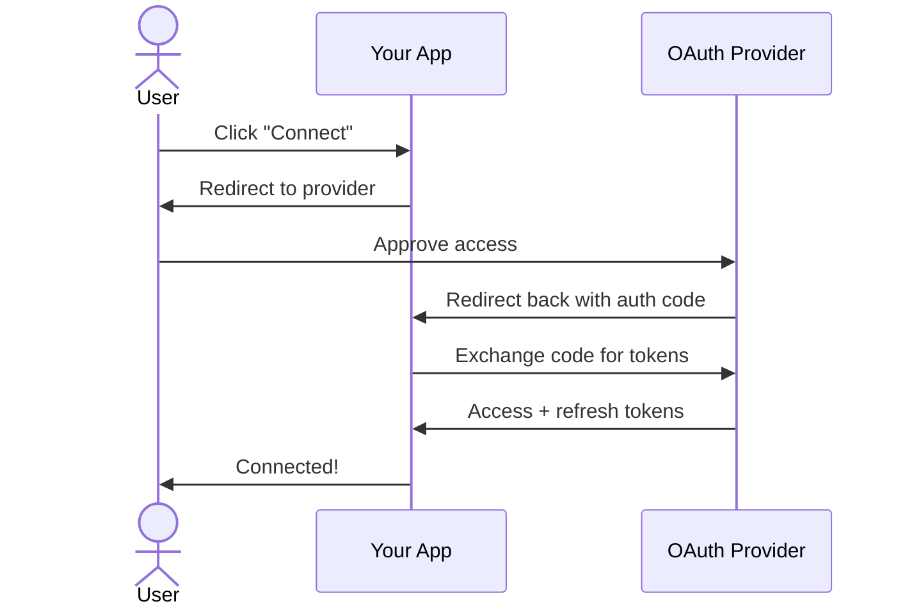

OAuth lets your users connect their own accounts to your app. Corsair handles state signing, token exchange, and encrypted storage — you just wire up two routes.



Corsair handles security details automatically — CSRF protection, HMAC state verification, and token encryption. Tokens are refreshed automatically before every API call.

---

<Steps>

<Step>

## Configure your app

Add an OAuth plugin to your corsair instance. Make sure `database` and `kek` are set — both are required for token storage.

<Info>
OAuth is supported by plugins like Gmail, Google Calendar, Notion, Spotify, Dropbox, and others.
</Info>

```ts corsair.ts
import { createCorsair } from 'corsair';
import { gmail } from '@corsair-dev/gmail';

export const corsair = createCorsair({
    plugins: [gmail()],
    kek: process.env.CORSAIR_KEK!,
    database: db,
});
```

Then store your OAuth app credentials once:

```bash
pnpm corsair setup --plugin=gmail client_id=YOUR_CLIENT_ID client_secret=YOUR_CLIENT_SECRET
```

</Step>

<Step>

## The connect route

`/api/connect` generates the provider's authorization URL and stores the HMAC-signed state in a cookie. The user is then redirected to the provider to approve access.

<Warning>
**This route must be authenticated.** 

If left open, anyone can call `/api/connect?plugin=gmail&tenantId=victim-id` and bind *their* OAuth grant to your victim's account, silently overwriting that tenant's stored tokens. Always read `tenantId` from your own session, never from a query parameter.
</Warning>

<Tabs>

<Tab title="Next.js">

```ts app/api/connect/route.ts
import { generateOAuthUrl } from 'corsair/oauth';
import type { NextRequest } from 'next/server';
import { NextResponse } from 'next/server';
import { corsair } from '@/server/corsair';
import { getSessionTenantId } from '@/server/auth'; // your auth logic

const REDIRECT_URI = `${process.env.APP_URL}/api/auth`;

export async function GET(request: NextRequest) {
    const tenantId = await getSessionTenantId(request);
    if (!tenantId) {
        return NextResponse.json({ error: 'Unauthorized' }, { status: 401 });
    }

    const plugin = new URL(request.url).searchParams.get('plugin');
    if (!plugin) {
        return NextResponse.json({ error: 'Missing plugin param' }, { status: 400 });
    }

    const { url, state } = await generateOAuthUrl(corsair, plugin, {
        tenantId,
        redirectUri: REDIRECT_URI,
    });

    const response = NextResponse.redirect(url);
    response.cookies.set('oauth_state', state, {
        httpOnly: true,   // not readable by JavaScript
        sameSite: 'lax',  // safe for provider redirects
        secure: process.env.NODE_ENV === 'production', // HTTPS only in prod
        maxAge: 60 * 10,  // expires in 10 minutes
    });
    return response;
}
```

</Tab>

<Tab title="Express">

<Warning>
The `pendingStates` set below is in-memory. It works for a single-instance local setup but will break across restarts or multiple servers. Replace it with Redis or a DB-backed store before going to production.
</Warning>

```ts routes/connect.ts
import { generateOAuthUrl } from 'corsair/oauth';
import type { Request, Response } from 'express';
import { corsair } from '../corsair';

const REDIRECT_URI = `${process.env.APP_URL}/api/auth`;

// Replace with Redis or DB-backed store in production
export const pendingStates = new Set<string>();

export async function connectHandler(req: Request, res: Response) {
    const tenantId = req.session?.userId; // from your session middleware
    if (!tenantId) {
        res.status(401).json({ error: 'Unauthorized' });
        return;
    }

    const plugin = req.query.plugin as string | undefined;
    if (!plugin) {
        res.status(400).json({ error: 'Missing plugin param' });
        return;
    }

    const { url, state } = await generateOAuthUrl(corsair, plugin, {
        tenantId,
        redirectUri: REDIRECT_URI,
    });

    pendingStates.add(state);
    res.cookie('oauth_state', state, {
        httpOnly: true,
        sameSite: 'lax',
        secure: process.env.NODE_ENV === 'production',
        maxAge: 10 * 60 * 1000, // 10 minutes in ms
    });
    res.redirect(url);
}
```

</Tab>

</Tabs>

</Step>

<Step>

## The callback route

After the user approves, the provider redirects to `/api/auth` with `?code=` and `?state=`. This route verifies the state, exchanges the code for tokens, and stores them encrypted for the tenant.

<Warning>
**This route must be authenticated.** Verify the `oauth_state` cookie matches the query param before calling `processOAuthCallback`. Always clear the cookie on both success *and* failure — a stale state cookie is a security risk.
</Warning>

<Tabs>

<Tab title="Next.js">

```ts app/api/auth/route.ts
import { processOAuthCallback } from 'corsair/oauth';
import type { NextRequest } from 'next/server';
import { NextResponse } from 'next/server';
import { corsair } from '@/server/corsair';

const REDIRECT_URI = `${process.env.APP_URL}/api/auth`;

function escapeHtml(value: string): string {
    return value
        .replace(/&/g, '&amp;')
        .replace(/</g, '&lt;')
        .replace(/>/g, '&gt;')
        .replace(/"/g, '&quot;')
        .replace(/'/g, '&#x27;');
}

export async function GET(request: NextRequest) {
    const { searchParams } = new URL(request.url);
    const code = searchParams.get('code');
    const state = searchParams.get('state');
    const error = searchParams.get('error');

    // Always clear the cookie — every exit path below must do this
    const clearCookie = {
        'Set-Cookie': 'oauth_state=; HttpOnly; Path=/; Max-Age=0',
        'Content-Type': 'text/html',
    };

    if (error) {
        return new NextResponse(
            `<html><body><h2>Authorization failed</h2><p>${escapeHtml(error)}</p></body></html>`,
            { status: 400, headers: clearCookie },
        );
    }

    if (!code || !state) {
        return new NextResponse('<p>Missing code or state.</p>', {
            status: 400,
            headers: clearCookie,
        });
    }

    const storedState = request.cookies.get('oauth_state')?.value;

    if (!storedState || storedState !== state) {
        return new NextResponse('<p>Invalid state. Possible CSRF attempt.</p>', {
            status: 400,
            headers: clearCookie,
        });
    }

    try {
        const result = await processOAuthCallback(corsair, {
            code,
            state,
            redirectUri: REDIRECT_URI,
        });

        const response = new NextResponse(
            `<html><body>
                <h2>Connected!</h2>
                <p><strong>${escapeHtml(result.plugin)}</strong> authorized for tenant
                <strong>${escapeHtml(result.tenantId)}</strong>.</p>
                <p><a href="/">Back to home</a></p>
            </body></html>`,
            { status: 200, headers: { 'Content-Type': 'text/html' } },
        );
        response.cookies.delete('oauth_state');
        return response;
    } catch (err) {
        const message = err instanceof Error ? err.message : String(err);
        const response = new NextResponse(
            `<html><body><h2>OAuth error</h2><p>${escapeHtml(message)}</p></body></html>`,
            { status: 500, headers: { 'Content-Type': 'text/html' } },
        );
        response.cookies.delete('oauth_state');
        return response;
    }
}
```

</Tab>

<Tab title="Express">

```ts routes/auth.ts
import { processOAuthCallback } from 'corsair/oauth';
import type { Request, Response } from 'express';
import { corsair } from '../corsair';
import { pendingStates } from './connect';

const REDIRECT_URI = `${process.env.APP_URL}/api/auth`;

function escapeHtml(value: string): string {
    return value
        .replace(/&/g, '&amp;')
        .replace(/</g, '&lt;')
        .replace(/>/g, '&gt;')
        .replace(/"/g, '&quot;')
        .replace(/'/g, '&#x27;');
}

export async function authCallbackHandler(req: Request, res: Response) {
    const code = req.query.code as string | undefined;
    const state = req.query.state as string | undefined;
    const error = req.query.error as string | undefined;

    res.clearCookie('oauth_state'); // always clear — success or failure

    if (error) {
        res.status(400).send(
            `<html><body><h2>Authorization failed</h2><p>${escapeHtml(error)}</p></body></html>`,
        );
        return;
    }

    if (!code || !state) {
        res.status(400).send('<p>Missing code or state parameter.</p>');
        return;
    }

    if (!pendingStates.has(state)) {
        res.status(400).send('<p>Invalid state. Possible CSRF attempt.</p>');
        return;
    }
    pendingStates.delete(state);

    try {
        const result = await processOAuthCallback(corsair, {
            code,
            state,
            redirectUri: REDIRECT_URI,
        });

        res.send(
            `<html><body><h2>Connected!</h2>` +
            `<p>Plugin <strong>${escapeHtml(result.plugin)}</strong> ` +
            `authorized for tenant <strong>${escapeHtml(result.tenantId)}</strong>.</p>` +
            `<p><a href="/">Back to home</a></p></body></html>`,
        );
    } catch (err) {
        const message = err instanceof Error ? err.message : String(err);
        res.status(500).send(
            `<html><body><h2>OAuth error</h2><p>${escapeHtml(message)}</p></body></html>`,
        );
    }
}
```

</Tab>

</Tabs>

</Step>

</Steps>

---

## Environment variables

| Variable | Description |
|---|---|
| `CORSAIR_KEK` | Key-encryption key — generate with `openssl rand -hex 32`. Never rotate without re-encrypting stored DEKs. |
| `APP_URL` | Your app's public base URL (e.g. `https://myapp.com`). Used to build `REDIRECT_URI`. |
| `NODE_ENV` | Set to `production` to enable the `secure` flag on cookies and other hardening. |

---

## Security checklist

<Check>Both `/api/connect` and `/api/auth` are authenticated routes</Check>
<Check>`tenantId` is read from your session — never from a query parameter</Check>
<Check>`oauth_state` cookie uses `httpOnly`, `sameSite: 'lax'`, and `secure` in production</Check>
<Check>`oauth_state` cookie is cleared on every exit path — success, failure, and CSRF mismatch</Check>
<Check>All user-controlled values are HTML-escaped before rendering</Check>
<Check>`APP_URL` points to your HTTPS domain in production</Check>
<Check>State store is Redis or DB-backed for multi-instance deployments</Check>

---

## What's next

<CardGroup cols={2}>
  <Card title="OAuth 2.0 Concepts" href="/concepts/oauth">
    How Corsair encrypts and stores tokens, and handles automatic refresh.
  </Card>
  <Card title="Multi-Tenancy" href="/concepts/multi-tenancy">
    Scoping every API call and database query per user with withTenant().
  </Card>
  <Card title="Gmail Plugin" href="/plugins/gmail/overview">
    Set up Gmail OAuth — a common starting point.
  </Card>
  <Card title="Google Calendar Plugin" href="/plugins/googlecalendar/overview">
    Another popular OAuth plugin to connect.
  </Card>
</CardGroup>
