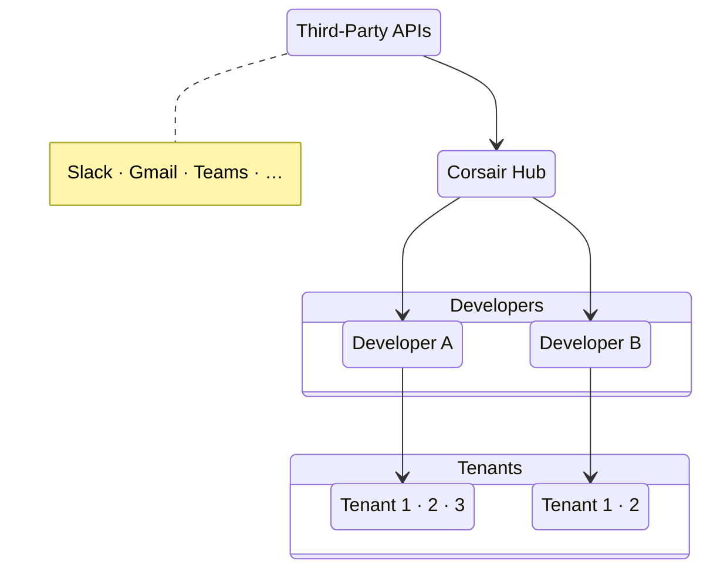

# Corsair Hub Architecture

Four-tier view of how third-party integrations reach developer apps and their tenants.

## Flow

1. **Third-party APIs** send OAuth redirects and webhooks to Corsair Hub.
2. **Corsair Hub** verifies and relays signed tunnel envelopes to each developer's app.
3. **Developers** run Corsair in their own stack (`POST /api/corsair`).
4. **Tenants** are each developer's end customers; every developer manages between two and four tenants (shown here as Tenant 1, Tenant 2, …).
