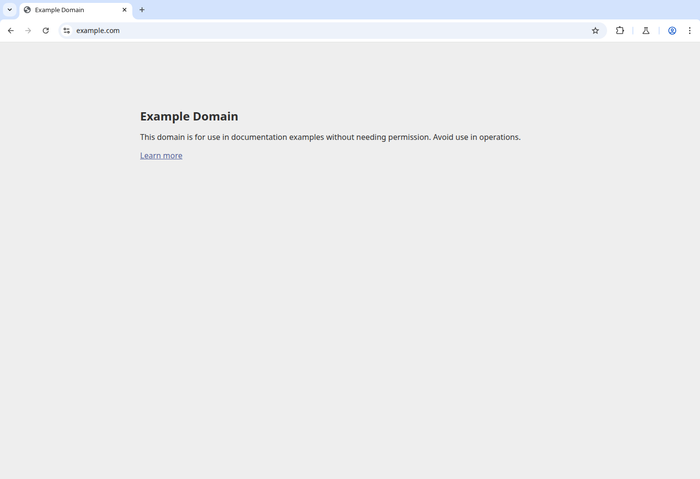

# `@corsair-dev/anchor_browser`

Anchor Browser integration plugin for Corsair.

## Auth / credentials

This provider authenticates via the `anchor-api-key` HTTP header.

Provide the key either:

- Via plugin options:

```ts
import { createCorsair } from "corsair";
import { anchor_browser } from "@corsair-dev/anchor_browser";

export const corsair = createCorsair({
  integrations: [
    anchor_browser({
      key: process.env.ANCHOR_BROWSER_API_KEY,
    }),
  ],
});
```

- Or via Corsair keys (if you’re using a shared key store): the plugin will fall back to `ctx.keys.get_api_key()` when `options.key` is not provided.

## Operations

The plugin exposes **64 operations** covering these endpoint groups:

- **sessions**: create/list/get/stop browser sessions, session actions
- **tasks**: create/get/list tasks, task actions
- **profiles**: create/update/list/get/delete profiles
- **pages**: page navigation and state
- **screenshots**: capture screenshots
- **recordings**: manage recordings

## Demo

Verified end-to-end: a real browser session is started, navigated to `https://example.com`, and a screenshot is captured through the plugin's request client (`makeAnchorBrowserRequest` → `POST /sessions` → `POST /sessions/{id}/goto` → `GET /sessions/{id}/screenshot`). The screenshot below is captured live by `scripts/demo-live-screenshot.mjs` against the Anchor Browser API (not a placeholder):



To reproduce the capture locally:

```sh
export ANCHOR_BROWSER_API_KEY="your-key-here"
pnpm --filter @corsair-dev/anchor_browser exec tsx scripts/demo-live-screenshot.mjs
```

The script prints the real JSON responses from `startBrowserSession` / `navigateToUrl` / `endBrowserSession` and writes a fresh `scripts/demo-session-screenshot.png`.
- **downloads / uploads**: manage transfers
- **events**: event streams and polling helpers
- **extensions / integrations**: manage browser add-ons and external integrations
- **mouse / keyboard / os-level**: input primitives and OS-level controls
- **agent / tools**: AI-agent helper endpoints and tool execution
- **cache-sync**: optional local caching + sync helpers

## Notes / quirks

- Requests are sent to Anchor Browser’s API with the required `anchor-api-key` header.
- Errors are normalized through `error-handlers.ts` (including rate-limit handling for `429`).

